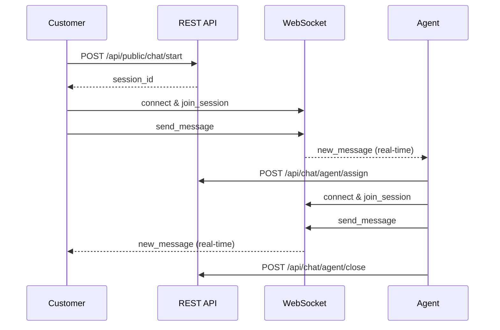

# LiveChat Backend - OSS Perizinan Berusaha

Sistem backend untuk livechat OSS (One Stop Service) perizinan berusaha dengan teknologi Go Fiber, PostgreSQL, Redis, dan WebSocket.

## 🚀 Fitur Utama

### 1. **Autentikasi & Otorisasi**
- JWT-based authentication
- Role-based access control (Admin, Agent)
- Session management dengan Redis

### 2. **Multi-Agent System**
- Departemen untuk agent (Perizinan, Investasi, Perpajakan, Teknis)
- Agent assignment otomatis berdasarkan departemen
- Status agent real-time (online, offline, busy, away)

### 3. **Chat System**
- Real-time messaging dengan WebSocket
- Multiple chat sessions per customer
- Message types: text, image, file, system
- Chat history dan logging lengkap

### 4. **Session Management**
- Setiap chat session mencatat:
  - Nama Perusahaan
  - Nama Person
  - Email
  - IP Address
  - Topik/Permasalahan
- Status tracking: waiting, active, closed
- Priority levels: low, normal, high, urgent

### 5. **Logging & Analytics**
- Chat logs untuk semua aktivitas
- Analytics untuk performa agent
- Metrics departemen
- Response time tracking

### 6. **Tagging System**
- Tags untuk kategorisasi chat
- Preset tags untuk perizinan berusaha
- Custom tags

## 🏗️ Arsitektur

Menggunakan **Clean Architecture** dengan struktur:

```
livechat-be/
├── cmd/                    # Application entry point
├── internal/
│   ├── domain/            # Business entities & interfaces
│   ├── usecase/           # Business logic
│   ├── infrastructure/    # External dependencies
│   └── delivery/          # HTTP handlers & middleware
├── pkg/                   # Shared packages
├── migrations/           # Database migrations
└── docs/                # Documentation
```

## 🛠️ Teknologi Stack

- **Framework**: Go Fiber v2
- **Database**: PostgreSQL
- **Cache**: Redis
- **WebSocket**: Gorilla WebSocket
- **ORM**: GORM (entities only)
- **Migration**: golang-migrate
- **Authentication**: JWT
- **Validation**: go-playground/validator
- **Logging**: logrus

## 📋 Prerequisites

- Go 1.21+
- PostgreSQL 12+
- Redis 6+
- golang-migrate (untuk migrasi database)

## 🚀 Quick Start

### 1. Clone & Setup

```bash
git clone <repository-url>
cd livechat-be
cp .env.example .env
# Edit .env dengan konfigurasi database Anda
```

### 2. Install Dependencies

```bash
make deps
```

### 3. Setup Database

```bash
# Buat database
make db-create

# Jalankan migrasi
make migrate-up
```

### 4. Run Application

```bash
# Development mode
make dev

# Production build
make build && make run
```

## 🌐 API Endpoints

### Authentication
- `POST /api/auth/login` - Login user
- `POST /api/auth/refresh` - Refresh access token
- `GET /api/auth/profile` - Get user profile
- `POST /api/auth/register` - Register user (admin only)

### Public Chat
- `POST /api/public/chat/start` - Start new chat session
- `POST /api/public/chat/message` - Send message (customer)
- `GET /api/public/chat/session/{id}/messages` - Get session messages

### Agent Chat
- `GET /api/chat/agent/sessions` - Get agent sessions
- `POST /api/chat/agent/message` - Send message (agent)
- `POST /api/chat/agent/assign` - Assign session to agent
- `POST /api/chat/agent/close` - Close session

### Admin Chat
- `GET /api/chat/admin/waiting` - Get waiting sessions
- `GET /api/chat/admin/active` - Get active sessions
- `POST /api/chat/admin/assign` - Assign agent to session
- `POST /api/chat/admin/close` - Close session

### WebSocket
- `ws://localhost:8080/ws/chat` - WebSocket connection


## � Alur Penggunaan Sistem

### 1. **Alur Customer (Publik)**
```
1. Customer mengakses website → Start Chat Session (API)
   POST /api/public/chat/start
   
2. Customer terhubung WebSocket → Join Session
   ws://localhost:8080/ws/chat
   
3. Customer kirim pesan → Send Message
   - Via API: POST /api/public/chat/message  
   - Via WebSocket: type "send_message"
   
4. Customer menerima respon agent secara real-time
   - Via WebSocket: type "new_message"
```

### 2. **Alur Agent**
```
1. Agent login → Authentication (API)
   POST /api/auth/login
   
2. Agent lihat session menunggu → Get Waiting Sessions (API)
   GET /api/chat/admin/waiting (admin)
   GET /api/chat/agent/sessions (agent own sessions)
   
3. Agent/Admin assign session → Assign Agent (API)
   POST /api/chat/agent/assign
   
4. Agent terhubung WebSocket → Join Session
   ws://localhost:8080/ws/chat
   
5. Agent balas pesan customer → Send Message
   - Via API: POST /api/chat/agent/message
   - Via WebSocket: type "send_message"
   
6. Agent menutup session → Close Session (API)
   POST /api/chat/agent/close
```

### 3. **Kombinasi API + WebSocket**

#### **API untuk:**
- ✅ Authentication & Authorization
- ✅ Session management (start, assign, close)
- ✅ Data persistence (messages, logs)
- ✅ Analytics & reporting
- ✅ CRUD operations

#### **WebSocket untuk:**
- ✅ Real-time messaging
- ✅ Typing indicators
- ✅ Session status updates
- ✅ Live notifications
- ✅ Instant message delivery

### 4. **Contoh Skenario Lengkap**



### 5. **Status Session Flow**

```
waiting → active → closed
   ↑         ↑        ↑
   |         |        |
Start    Assign   Close
Chat     Agent    Session
```

### 6. **Multi-Channel Support**

**Customer bisa gunakan:**
- 🌐 Web Browser (WebSocket)
- 📱 Mobile App (API + WebSocket)
- 💬 Chat Widget (WebSocket)

**Agent bisa gunakan:**
- 🖥️ Admin Dashboard (API + WebSocket)
- 📱 Mobile Agent App (API)
- 💻 Desktop App (WebSocket)

## �📝 Database Schema


### Entities Utama:
- **Users**: Admin dan Agent
- **Departments**: Departemen agent
- **Customers**: Data customer
- **ChatSessions**: Session chat
- **ChatMessages**: Pesan chat
- **ChatLogs**: Log aktivitas
- **ChatTags**: Tags untuk kategorisasi
- **AgentStatus**: Status agent
- **ChatAnalytics**: Data analytics

## 🔐 Authentication

### Access Token & Refresh Token System

Sistem autentikasi menggunakan **dual token approach**:

- **Access Token**: Token pendek (15 menit) untuk akses API
- **Refresh Token**: Token panjang (7 hari) untuk memperbarui access token

### Login
```bash
curl -X POST http://localhost:8080/api/auth/login \
  -H "Content-Type: application/json" \
  -d '{
    "email": "admin@livechat.com",
    "password": "password"
  }'
```

**Response:**
```json
{
  "success": true,
  "message": "Login successful",
  "data": {
    "access_token": "eyJhbGciOiJIUzI1NiIsInR5cCI6IkpXVCJ9...",
    "refresh_token": "eyJhbGciOiJIUzI1NiIsInR5cCI6IkpXVCJ9...",
    "expires_in": 900,
    "expires_at": "2025-07-19T10:15:00Z",
    "user": {
      "id": "uuid",
      "email": "admin@livechat.com",
      "name": "Admin User",
      "role": "admin"
    }
  }
}
```

### Refresh Token
```bash
curl -X POST http://localhost:8080/api/auth/refresh \
  -H "Content-Type: application/json" \
  -d '{
    "refresh_token": "your_refresh_token_here"
  }'
```

### Use Access Token
```bash
curl -X GET http://localhost:8080/api/auth/profile \
  -H "Authorization: Bearer YOUR_ACCESS_TOKEN"
```

### Token Flow
```
1. Login → Receive access_token + refresh_token
2. Use access_token for API calls (15 minutes)
3. When access_token expires → Use refresh_token to get new tokens
4. Continue using new access_token
5. When refresh_token expires (7 days) → Login again
```

## 💬 WebSocket Usage

### Connect
```javascript
const ws = new WebSocket('ws://localhost:8080/ws/chat');

ws.onopen = function() {
  // Join session
  ws.send(JSON.stringify({
    type: 'join_session',
    session_id: 'session-uuid',
    data: {}
  }));
};

ws.onmessage = function(event) {
  const response = JSON.parse(event.data);
  console.log('Received:', response);
};
```

### Send Message
```javascript
ws.send(JSON.stringify({
  type: 'send_message',
  session_id: 'session-uuid',
  data: {
    message: 'Hello, I need help with my business permit'
  }
}));
```

## 📊 Default Data

Setelah migrasi, system akan memiliki:

### Departments:
- Perizinan Usaha
- Investasi  
- Perpajakan
- Teknis

### Default Users:
- Admin: `admin@livechat.com` / `password`
- Agents: `agent1@livechat.com` sampai `agent5@livechat.com` / `password`

### Default Tags:
- Perizinan Baru
- Perpanjangan Izin
- Investasi PMA/PMDN
- Pajak Daerah
- Masalah Teknis
- dll

## 🔧 Development

### Commands
```bash
make dev         # Run in development mode
make build       # Build application
make test        # Run tests
make lint        # Lint code
make fmt         # Format code
make docs        # Generate swagger docs
```

### Database Migration
```bash
make migrate-create  # Create new migration
make migrate-up      # Run migrations
make migrate-down    # Rollback migrations
```

## 📈 Analytics Features

- Total chat sessions
- Response time metrics
- Agent performance tracking
- Department analytics
- Daily/weekly/monthly reports

## 🔒 Security Features

- JWT authentication
- Role-based access control
- IP address logging
- Session timeout
- Request rate limiting (can be added)

## 🚀 Production Deployment

### Docker
```bash
make docker-build
make docker-run
```

### Environment Variables
```bash
# Database
DB_HOST=localhost
DB_PORT=5432
DB_USER=postgres
DB_PASSWORD=password
DB_NAME=livechat_db

# Redis
REDIS_HOST=localhost
REDIS_PORT=6379

# JWT
JWT_SECRET=your-secret-key
JWT_ACCESS_TOKEN_DURATION=15m
JWT_REFRESH_TOKEN_DURATION=168h

# Server
SERVER_PORT=8080
```

## 🤝 Contributing

1. Fork the repository
2. Create feature branch
3. Commit changes
4. Push to branch
5. Create Pull Request

## 📄 License

This project is licensed under the MIT License.

## 📞 Support

Untuk pertanyaan atau dukungan, silakan buat issue di repository ini.
